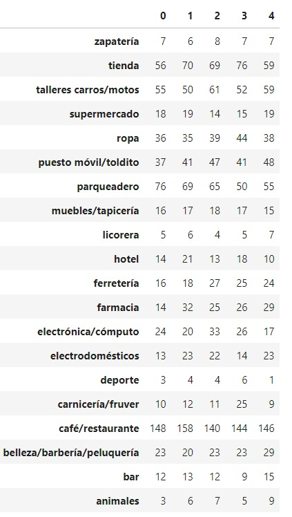

# tf-challenge-iris

## Clases distribution

## Todo guide:
* https://www.kaggle.com/georgiisirotenko/pytorch-tpu-baseline-flowers-tranlearning-ensemble
* https://www.kaggle.com/atamazian/fc-ensemble-external-data-effnet-densenet
* image resolution by model (efficietnet) https://keras.io/examples/vision/image_classification_efficientnet_fine_tuning/